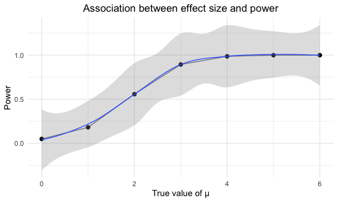
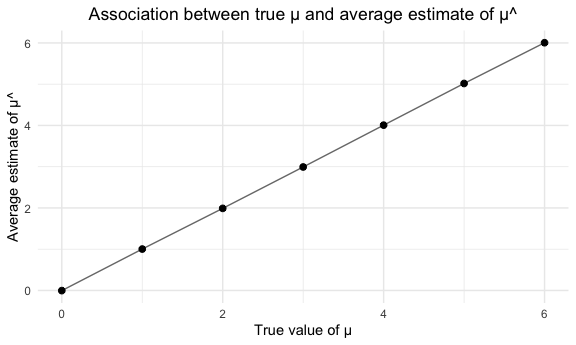
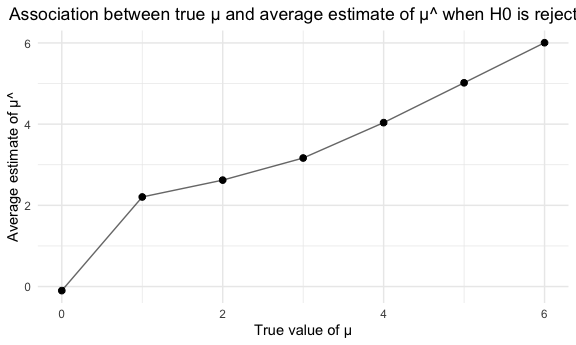

Homework 5
================
Ziyan Xu
11/10/2022

-   <a href="#problem-2" id="toc-problem-2">Problem 2</a>
-   <a href="#problem-3" id="toc-problem-3">Problem 3</a>

This is my solution to HW5.

### Problem 2

#### Load and describe the raw dataset

This dataset contains 52179 rows and 12 columns.

The data contains the location of the killing, whether an arrest was
made, basic demographic information of each victim. There are victim
info variables – victim_last, victim_first, victim_race, victim_age and
victim_sex, location variables – city, state, lat and lon, and case info
– uid, reported_date and disposition.

#### Clean the dataset

    ## # A tibble: 50 × 3
    ##    city_state      unsolved total
    ##    <chr>              <int> <int>
    ##  1 Albuquerque, NM      146   378
    ##  2 Atlanta, GA          373   973
    ##  3 Baltimore, MD       1825  2827
    ##  4 Baton Rouge, LA      196   424
    ##  5 Birmingham, AL       347   800
    ##  6 Boston, MA           310   614
    ##  7 Buffalo, NY          319   521
    ##  8 Charlotte, NC        206   687
    ##  9 Chicago, IL         4073  5535
    ## 10 Cincinnati, OH       309   694
    ## # … with 40 more rows

#### Proportion of unsolved homicides

Run `prop.test` for Baltimore, MD.

``` r
baltimore_summary = 
  homicide_df %>% 
  filter(city_state == "Baltimore, MD")
baltimore_test =
  prop.test(
    pull(baltimore_summary, unsolved), 
    pull(baltimore_summary, total)) %>% 
  broom::tidy() %>% 
  select(estimate, starts_with("conf"))
baltimore_test
```

    ## # A tibble: 1 × 3
    ##   estimate conf.low conf.high
    ##      <dbl>    <dbl>     <dbl>
    ## 1    0.646    0.628     0.663

Run `prop.test` for each city.

``` r
homicide_cities =
  homicide_df %>%
  mutate(
    test_results = map2(unsolved, total, prop.test),
    tidy_results = map(test_results, broom::tidy)) %>% 
  select(city_state, tidy_results) %>% 
  unnest(tidy_results) %>% 
  select(city_state, estimate, starts_with("conf"))
homicide_cities
```

    ## # A tibble: 50 × 4
    ##    city_state      estimate conf.low conf.high
    ##    <chr>              <dbl>    <dbl>     <dbl>
    ##  1 Albuquerque, NM    0.386    0.337     0.438
    ##  2 Atlanta, GA        0.383    0.353     0.415
    ##  3 Baltimore, MD      0.646    0.628     0.663
    ##  4 Baton Rouge, LA    0.462    0.414     0.511
    ##  5 Birmingham, AL     0.434    0.399     0.469
    ##  6 Boston, MA         0.505    0.465     0.545
    ##  7 Buffalo, NY        0.612    0.569     0.654
    ##  8 Charlotte, NC      0.300    0.266     0.336
    ##  9 Chicago, IL        0.736    0.724     0.747
    ## 10 Cincinnati, OH     0.445    0.408     0.483
    ## # … with 40 more rows

A scatterplot that showing the estimates and CIs for each city.


### Problem 3

#### Create the function

For $\mu = 0$, generate 5000 datasets from the model $X \sim N(0,5)$
with sample size of 30.

``` r
set.seed(1)

norm_fun <- function(mu,n = 30, sigma = 5)
{
  sim_data = tibble(x = rnorm(n, mean = mu,sd = sigma),)
  sim_data %>%
    mutate(mu_hat = broom::tidy(t.test(sim_data))$estimate,
           p_value = broom::tidy(t.test(sim_data))$p.value) %>%
    select(-x) %>%
    distinct()
}

sim0_df = rerun(5000,norm_fun(mu = 0)) %>%
  bind_rows()
```

#### Simulation for mu = 0,1,2,3,4,5,6

``` r
sim_df <- tibble(mu = c(0:6)) %>% 
  mutate(output_list = map(.x = mu, ~rerun(5000, norm_fun(mu = .x))),
         result_df = map(output_list,bind_rows)) %>%
  select(-output_list) %>%
  unnest(result_df) %>%
  mutate(Null_hypothesis = ifelse(p_value >= 0.05, "Fail to reject",'Reject'))  
  head(sim_df)
```

    ## # A tibble: 6 × 4
    ##      mu mu_hat p_value Null_hypothesis
    ##   <int>  <dbl>   <dbl> <chr>          
    ## 1     0  0.520   0.549 Fail to reject 
    ## 2     0  1.11    0.188 Fail to reject 
    ## 3     0  1.01    0.220 Fail to reject 
    ## 4     0 -0.835   0.309 Fail to reject 
    ## 5     0 -0.892   0.365 Fail to reject 
    ## 6     0  0.557   0.503 Fail to reject

#### Make a plot to show association between effect size and power.

``` r
sim_df %>%
  group_by(mu) %>%
  summarize(power = sum(Null_hypothesis == 'Reject')/n()) %>% 
  ggplot(aes(x = mu, y = power))+
  geom_point(size = 2)+
  geom_line(alpha = 0.6)+
  geom_smooth(alpha = 0.3,size = 0.5)+
  labs( title = "Association between effect size and power",
        x = "True value of μ",
        y = "Power") +
  theme(plot.title = element_text(hjust = .5))
```



As effect size increases, power increases, when effect size is high
enough (in this case: mu \>= 4), power is approximately equal to 1.

#### Make a plot showing the average estimate of μ^ on the y axis and the true μ

``` r
sim_df %>%
  group_by(mu) %>%
  summarize(average_mu_hat = mean(mu_hat)) %>%
  ggplot(aes(x = mu, y = average_mu_hat))+
  geom_point(size = 2)+
  geom_line(alpha = 0.6)+
  labs( title = "Association between true μ and average estimate of μ^",
        x = "True value of μ",
        y = "Average estimate of μ^") +
  theme(plot.title = element_text(hjust = .5))
```



Clearly the average estimate of μ^ is approximately equal to true μ in
this 5000 times simulation for μ = 0,1,2,3,4,5,6

#### Make a plot showing the average estimate of μ^ on the y axis and the true μ in samples for which the null was rejected

``` r
sim_df %>%
  filter(Null_hypothesis == 'Reject') %>%
  group_by(mu) %>%
  summarize(average_mu_hat = mean(mu_hat)) %>%
  ggplot(aes(x = mu, y = average_mu_hat))+
  geom_point(size = 2)+
  geom_line(alpha = 0.6)+
  labs( title = "Association between true μ and average estimate of μ^ when H0 is rejected",
        x = "True value of μ",
        y = "Average estimate of μ^") +
  theme(plot.title = element_text(hjust = .5))
```



Across test for which the null hypothesis is rejected, when true μ =
0,1,2,3, which means that the true μ is relatively close to the null
hypothesis(μ = 0), the average estimate of μ^ is not equal to true value
of μ. This is because μ^ for those null hypothesis is rejected are
biased from population mean since the proportion of rejecting μ = 0 is
not high enough. In a special case when population mean = 1, μ^ needs to
be larger to reject H0 (which is μ = 0), so average estimate of μ^ is
above 2.

When true μ is so large that the null hypothesis is always rejected, the
average estimate of μ^ is approximately equal to true value of μ. This
is because the average estimate of μ^ basically represent the estimate
of μ in 5000 samples simulated from normal distribution, which equals to
the population mean.
