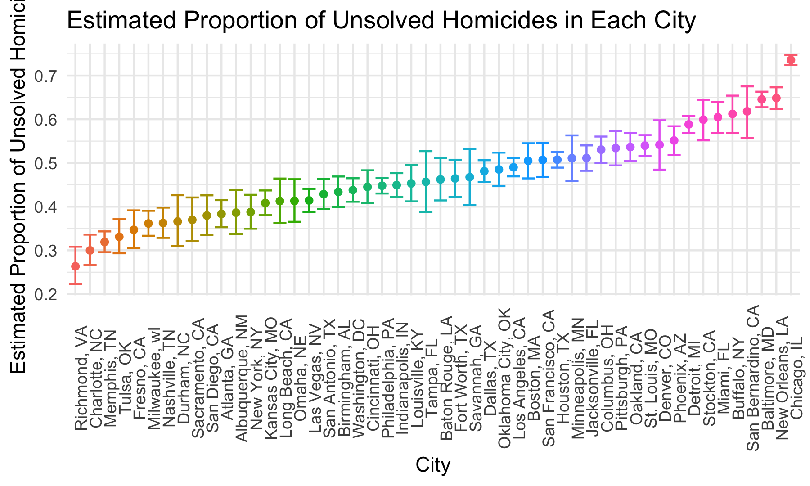

Homework 5
================
Ziyan Xu
11/10/2022

-   <a href="#problem-1" id="toc-problem-1">Problem 1</a>
-   <a href="#problem-2" id="toc-problem-2">Problem 2</a>
-   <a href="#problem-3" id="toc-problem-3">Problem 3</a>

This is my solution to HW5.

### Problem 1

### Problem 2

#### Load and describe the raw dataset

This dataset contains 52179 rows and 12 columns.

The data contains the location of the killing, whether an arrest was
made, basic demographic information of each victim. There are victim
info variables – victim_last, victim_first, victim_race, victim_age and
victim_sex, location variables – city, state, lat and lon, and case info
– uid, reported_date and disposition.

#### Clean the dataset

    ## # A tibble: 50 × 3
    ##    city_state      unsolved total
    ##    <chr>              <int> <int>
    ##  1 Albuquerque, NM      146   378
    ##  2 Atlanta, GA          373   973
    ##  3 Baltimore, MD       1825  2827
    ##  4 Baton Rouge, LA      196   424
    ##  5 Birmingham, AL       347   800
    ##  6 Boston, MA           310   614
    ##  7 Buffalo, NY          319   521
    ##  8 Charlotte, NC        206   687
    ##  9 Chicago, IL         4073  5535
    ## 10 Cincinnati, OH       309   694
    ## # … with 40 more rows

#### Proportion of unsolved homicides

Run `prop.test` for Baltimore, MD.

``` r
baltimore_summary = 
  homicide_df %>% 
  filter(city_state == "Baltimore, MD")
baltimore_test =
  prop.test(
    pull(baltimore_summary, unsolved), 
    pull(baltimore_summary, total)) %>% 
  broom::tidy() %>% 
  select(estimate, starts_with("conf"))
baltimore_test
```

    ## # A tibble: 1 × 3
    ##   estimate conf.low conf.high
    ##      <dbl>    <dbl>     <dbl>
    ## 1    0.646    0.628     0.663

Run `prop.test` for each city.

``` r
homicide_cities =
  homicide_df %>%
  mutate(
    test_results = map2(unsolved, total, prop.test),
    tidy_results = map(test_results, broom::tidy)) %>% 
  select(city_state, tidy_results) %>% 
  unnest(tidy_results) %>% 
  select(city_state, estimate, starts_with("conf"))
homicide_cities
```

    ## # A tibble: 50 × 4
    ##    city_state      estimate conf.low conf.high
    ##    <chr>              <dbl>    <dbl>     <dbl>
    ##  1 Albuquerque, NM    0.386    0.337     0.438
    ##  2 Atlanta, GA        0.383    0.353     0.415
    ##  3 Baltimore, MD      0.646    0.628     0.663
    ##  4 Baton Rouge, LA    0.462    0.414     0.511
    ##  5 Birmingham, AL     0.434    0.399     0.469
    ##  6 Boston, MA         0.505    0.465     0.545
    ##  7 Buffalo, NY        0.612    0.569     0.654
    ##  8 Charlotte, NC      0.300    0.266     0.336
    ##  9 Chicago, IL        0.736    0.724     0.747
    ## 10 Cincinnati, OH     0.445    0.408     0.483
    ## # … with 40 more rows

Scatterplot showing the estimates and CIs for each city.



### Problem 3
